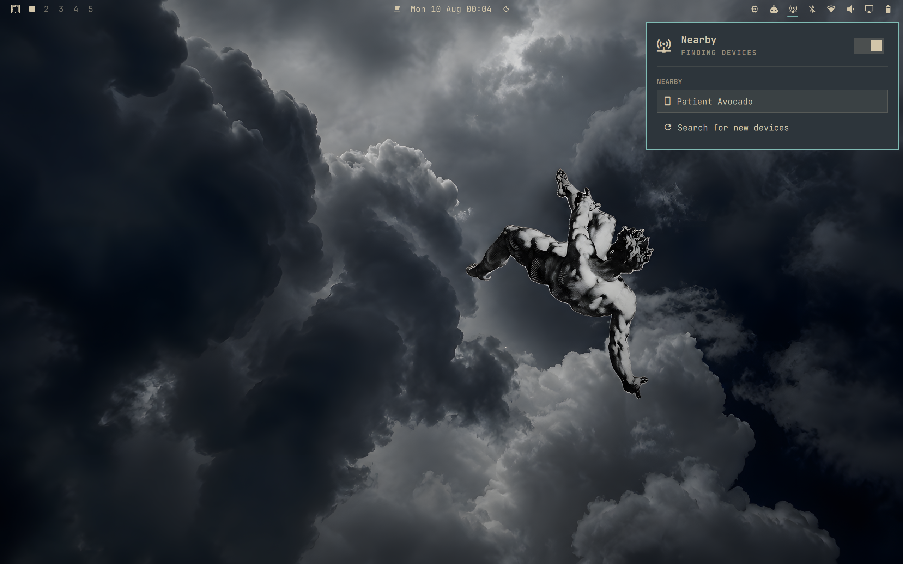
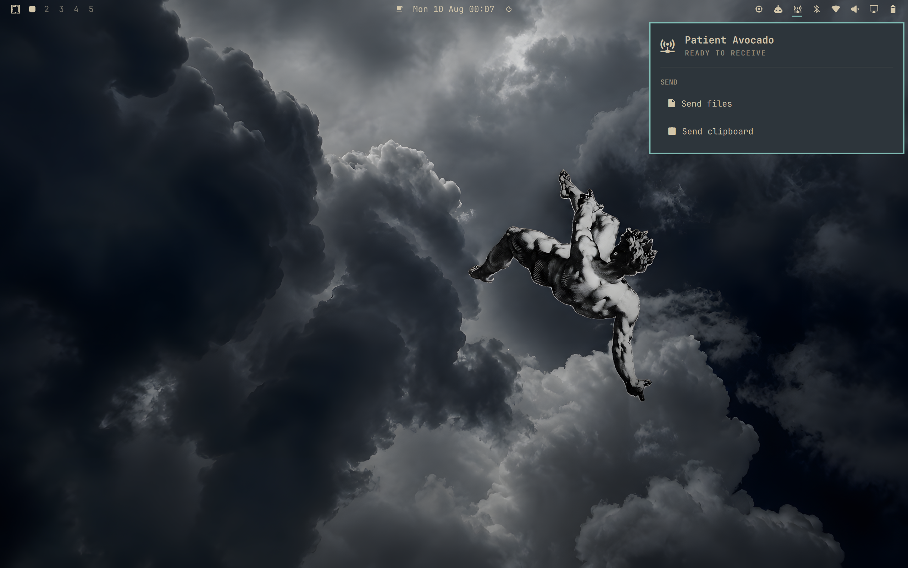

# Omarchy Nearby

Native nearby sharing for Omarchy, compatible with the LocalSend protocol.

Nearby is not a launcher for the LocalSend application. It implements the network
peer inside an Omarchy/Quickshell widget: discovery, sending, receiving, approval,
progress, clipboard text and transfer lifecycle are handled by the widget and its
Rust helper.

> Independent project. Not affiliated with or endorsed by LocalSend or Omarchy.

## Screenshots

### Discover devices



### Send files or clipboard text



## Features

- Native Omarchy bar widget and popup
- Discover compatible devices on the local network
- Send one or more files
- Send clipboard text
- Receive files and text
- Accept/decline incoming transfers
- Transfer progress, completion, cancellation and error states
- HTTPS LocalSend interoperability with certificate fingerprint handling
- Passive discovery while Nearby is enabled
- Active discovery only while the popup is open
- Cache-first HTTP fallback when multicast discovery does not confirm a known peer
- Incremental subnet fallback with a global concurrency limit
- Files saved safely using temporary partial files and atomic finalization

## Discovery model

Nearby deliberately uses a cheap-first discovery hierarchy:

1. Passive listener while Nearby is enabled.
2. Immediate multicast announcement when the popup opens.
3. Short grace period for multicast/register responses.
4. Direct HTTP probes of recently known peer IPs as hints, never as proof of availability.
5. Full subnet HTTP scan only as a last resort.

Cached peers are revalidated over the network before being treated as confirmed.
Subnet fallback uses each interface's real IPv4 netmask. Networks up to `/22` are
scanned completely; larger networks are bounded to the local `/24` of each selected
interface to avoid generating tens of thousands of probes.
The panel also provides **Search for new devices**, which bypasses cache-hit
short-circuiting and forces the bounded subnet scan when a new peer is missing.

### iOS note

During testing, the official LocalSend Android client responded to active discovery
immediately. The iOS client can enter a state where it remains visibly open but does
not confirm the multicast discovery round. In that case Nearby falls back to a cached
IP probe, or to a subnet scan when no usable cache entry exists. This is documented as
an interoperability limitation rather than worked around by making the normal path
more aggressive.

## Requirements

Runtime:

- Omarchy with the Quickshell-based shell/plugin system
- `zenity` for file selection
- `wl-clipboard` (`wl-copy` / `wl-paste`) for text sharing
- `libnotify` (`notify-send`) for desktop notifications
- Local network access to TCP/UDP port `53317`

The recommended installation uses a prebuilt Linux x86_64 helper and does not
require Rust. Building from source requires:

- Rust toolchain with Cargo

## Build

The repository intentionally does **not** track a machine-built helper binary.
Build it locally:

```sh
./build.sh
```

This creates:

```text
bin/omarchy-nearby-helper
```

## Install

Download and run the small installer:

```sh
curl -fsSL https://raw.githubusercontent.com/jfg96/omarchy-nearby/main/install.sh \
  -o /tmp/omarchy-nearby-install.sh
bash /tmp/omarchy-nearby-install.sh
```

The installer uses Omarchy's plugin manager, resolves a published release to an
exact tag, downloads the Linux x86_64 helper built from that tag, verifies its
SHA256, installs it atomically, and enables `oma.nearby`. It does not use `sudo`,
install packages, install Rust, or compile code.

Install or reinstall a specific release with:

```sh
bash /tmp/omarchy-nearby-install.sh v1.0.0
```

The widget is placed in the right section of the bar by default. Omarchy manages
removal with `omarchy plugin remove oma.nearby`.

### Updates

Prebuilt installations must be updated with Nearby's installer so the plugin and
helper move to the same release together:

```sh
~/.config/omarchy/plugins/oma.nearby/install.sh
```

Running `omarchy plugin update oma.nearby` updates source files but cannot update
the release helper. Nearby detects that version mismatch, stops the backend, and
asks you to run the installer again.

### Install from source

The complete source remains in every release. To build the exact same helper
locally, install the plugin without enabling it, build, then enable it:

```sh
omarchy plugin add https://github.com/jfg96/omarchy-nearby.git --yes
cd ~/.config/omarchy/plugins/oma.nearby
./build.sh
omarchy plugin enable oma.nearby
```

Received files are written to the user's Downloads directory according to the
backend's current save-path logic.
Interrupted receives use `.nearby-*.part` files. On startup, Nearby removes only
its own partial files that are older than 24 hours.

## Lifecycle

- **Nearby off:** helper/backend stopped; no receiver or discovery activity.
- **Nearby on, popup closed:** receiver and passive discovery remain available.
- **Nearby on, popup open:** active discovery is added.
- **Popup closed:** active discovery/fallback work is cancelled without disabling receiving.

## Architecture

```text
Quickshell UI (Panel.qml)
        │
        ├── Model.js
        │
        └── JSON over stdin/stdout
                 │
                 ▼
       omarchy-nearby-helper
              (Rust)
                 │
                 ▼
        LocalSend-compatible LAN peer
```

The Rust helper vendors a modified `localsend-rs` library. See
`THIRD_PARTY_NOTICES.md` for attribution and licensing information.

## Releases

Stable releases use tags such as `v1.0.0`. The tag, `manifest.json`, Rust package,
and helper all carry the same version. Release helpers are built only by GitHub
Actions and are stored only as GitHub Release assets, together with a SHA256 file
and generated third-party license notices.

Development on `main` uses the next SemVer prerelease, such as `1.0.1-dev`, as
soon as it diverges from the preceding stable tag. Both `manifest.json` and
`backend/Cargo.toml` must be advanced together before functional changes land.
This ensures an accidental source-only plugin update cannot be mistaken for the
previous release.

## Tests

Frontend model tests:

```sh
node tests/model.test.js
```

Backend tests:

```sh
cargo test --manifest-path backend/Cargo.toml
cargo test --manifest-path backend/vendor/localsend-rs/Cargo.toml --features https
```

A larger manual interoperability and robustness checklist is kept in
`ROBUSTNESS.md`.

## Security notes

Nearby validates transfer paths and writes incoming files through temporary partial
files before finalization. TLS fingerprints are used for peer connections where the
LocalSend protocol exposes them.

LocalSend discovery itself is LAN discovery and should not be treated as an
authenticated pairing mechanism. Use Nearby on networks you trust.

## License

Nearby is MIT licensed. See `LICENSE`.

The vendored `localsend-rs` code is separately MIT licensed and carries its own
notices. See `THIRD_PARTY_NOTICES.md`.
